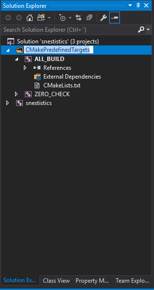
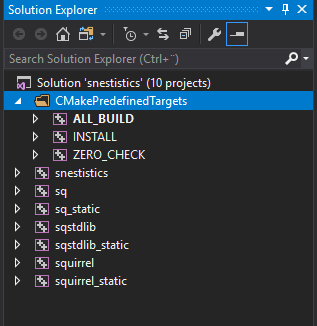
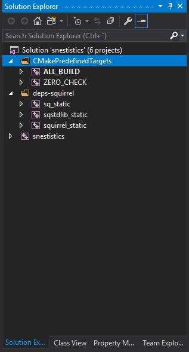

Introduction
============
Today I want to talk about using [cmake](https://cmake.org/) with Visual Studio on Windows. I use cmake to generate build files for Visual Studio and it helps me build on other platforms as well. I used to have my own project generator but cmake has improved a lot and some of the problems with cmake has gone away (one being that I no longer care about 32-bit compilation). I especially like the new target inheritance mechanisms described in this [blog post](https://schneide.wordpress.com/2016/04/08/modern-cmake-with-target_link_libraries/). The cmake macro language itself is never fun to use but I don't mind it as much anymore. When using cmake with my own code I am mostly happy. But then comes.. external dependencies! In this blog post I will show how I would want it to work. While I've been using cmake for a long time I do hope that a reader suggests better ways to do this.

External Dependencies
=====================
I recently added scripting support to an application I am developing on my spare time called snestistics. I needed a scripting language and I choose the scripting language [squirrel](https://github.com/albertodemichelis/squirrel). That meant I had my first external dependency. Up to this point I had written all code myself, only depending on the standard library.

I use GIT and I prefer to keep all my dependencies in my source tree (as opposed to letting the user download/build/install them on the system somewhere). That way I can control the exact version being compiled. This time I choose to use a git submodule but sometimes I just put a zip file of the source code in my repository and extract it using cmake on the first compile.

The alternative on some platforms would be to let the user build squirrel themselves and install it on their system. This could perhaps happen as part of an *apt-get*/*homebrew* command or something. But then I have little control over the exact version and I can't change build settings. This might be ok on some systems but at least on Windows having explicit control is very important. Since C++ does not have an standard ABI (application binary interface) you must compile all libraries being linked together with the same compiler (most of the time) and with mostly the same compiler settings. Otherwise things will crash. This also makes it impossible to link together release and debug built libraries in most cases.

Because of this I like that all dependencies are compiled _with_ my application. That is they are never pre-built and they live in my Visual Studio solution. This makes it easy to experiment with compiler settings, compiler versions etc without having to build/install a lot of different projects. I just change in cmake and it it propagated to all libraries. Switching between different configurations (Release, Debug, ...) doesn't put you in situation where you have mismatch between the different libraries being linked together. Debug build is always available as well as the source code is always available if I want to step into the code of a dependency to see what it does. I simply think it is a nicer way to organize the code. For foreign code that only comes pre-built this is not an option but lets not discuss that today.

Disclaimer; For larger projects that take a long time to compile I realize that pre-building some libraries and keeping them out of the Visual Studio solution helps compile times when building for the first time or doing full rebuild of all projects in the solution.

World shortest cmake tutorial
=============================

So how do we do this in cmake? Quick cmake recap first! Cmake requires a file CMakeLists.txt in each directory. From a CMakeLists.txt you can include another directory using add_subdirectory. Cmake is invoked on the root directory (where the root CMakeLists.txt lives) and then it generates Visual Studio projects (or makefiles) into a directory chosen by the user.

Squirrel
========

Before squirrel my root CMakeLists.txt looked like this:
~~~~~~~~~~
cmake_minimum_required (VERSION 2.8.11)
project(snestistics)

set(CMAKE_CXX_STANDARD 11)
set(CMAKE_CXX_STANDARD_REQUIRED on)

if(MSVC)
	add_compile_options(/MP) # Allow multi-processor building
	set_property(GLOBAL PROPERTY USE_FOLDERS ON)
endif(MSVC)

add_subdirectory(source)
~~~~~~~~~~

As we can see I have a few build settings that I like all the projects to use. I added the squirrel repro as a GIT submodule in a directory named squirrel. I got the following Visual Studio projects:

Then I simply tried what felt most natural to me and added a line to my root CMakeLists.txt like this:

~~~~~~~~~~
cmake_minimum_required (VERSION 2.8.11)
project(snestistics)

...

add_subdirectory(squirrel) # The new line!
add_subdirectory(source)
~~~~~~~~~~

To some degree this actually worked and it made me very happy. Quite a few squirrel libraries popped up in my solution.

That way in source I can simply add a dependency to the squirrel CMakeLists.txt like this

~~~~~~~~~~
...
add_executable(snestistics ${SOURCES})
target_link_libraries(snestistics squirrel_static)
target_link_libraries(snestistics sqstdlib_static)
include_directories("../deps/squirrel/include")
~~~~~~~~~~

Now I only want to build all dependencies statically into my binary so I don't care about building DLLs for squirrel. Also I didn't need the example squirrel interpretor binary. So to get less squirrel projects in my solution I added this around the call to add_subdirectory(squirrel).

~~~~~~~~~~
set(DISABLE_DYNAMIC 1)
set(SQ_DISABLE_INSTALLER 1)

add_subdirectory(squirrel)

# Make sure sq_static isn't built
set_target_properties(sq_static PROPERTIES 
	EXCLUDE_FROM_ALL 1
	EXCLUDE_FROM_DEFAULT_BUILD 1)

if(MSVC)
	# Visual Studio folders
	set_target_properties(sq_static       PROPERTIES FOLDER squirrel)
	set_target_properties(sqstdlib_static PROPERTIES FOLDER squirrel)
	set_target_properties(squirrel_static PROPERTIES FOLDER squirrel)
endif(MSVC)

# Don't include the dynamic (shared) libraries
set(DISABLE_DYNAMIC)

# Make sure nothing is installed by squirrel. That should be managed by snestistics
set(SQ_DISABLE_INSTALLER)
~~~~~~~~~~
I also move the remaining projects into folders in Visual Studio so I don't have to see them all the time. For sq_static I didn't manage to remove it, but I managed to remove everything being built using EXCLUDE_FROM_ALL and EXCLUDE_FROM_DEFAULT_BUILD. The variables DISABLE_DYNAMIC and SQ_DISABLE_INSTALLER are squirrel specific and I had to look at the squirrel cmake file to know that they existed.

Another library - Let's test ZLIB
=================================
I tried the same thing with ZLIB. It sortof worked but I got a lot of extra libraries, including example projects. I could use EXCLUDE_FROM_ALL/EXCLUDE_FROM_DEFAULT_BUILD to disable building but I would really liked a varialbe to turn them off before adding the directory.

Some sort of solution
=====================

It would be nice if projects could operate in two modes. One is when they are root. Generate everything, install stuff. The second when being used as a library. Don't build tests/examples (unless when asked for) and don't install anything.

It would also be nice if projects didn't have to produce both static and non-static variants. That could happen automatically by inheriting settings from the outside world. Something like

~~~~~~~~~~~~~~~
add_subdirectory(directory STATIC)
~~~~~~~~~~~~~~~
or
~~~~~~~~~~~~~~~
set(mode_zlib STATIC)
add_subdirectory(zlib) # Will read modes for project zlib from mode_zlib
~~~~~~~~~~~~~~~

It is possible for a script to see if it is running as root or not using something like
~~~~~~~~~~~~~~~
if( CMAKE_SOURCE_DIR STREQUAL CMAKE_CURRENT_SOURCE_DIR )
	set( STANDALONE TRUE )
endif()
~~~~~~~~~~~~~~~

Further complications
=====================
When I include a library that has no dependencies it works like shown above. I have a quite a bit of control. But once a dependency has dependencies of its own it does it on its terms. Because of this it would be nice if cmake had a general facility to solve this. The one facility that I've found and often seen used is find_package. It seems tailored toward libraries being pre-built and installed on the system, but I am hoping it can be used/abused in a smart way to give me what I want. Anyone has an example for this?

Final Thoughts
==============
This is all for today. Before I leave I want to state that while this makes sense under Windows and Visual Studio it might not make sense on linux/osx. There the make/make install paradigm is more established. If I need to I will treat external dependencies differently on different platforms. Unless someone comes up with a solution for me I will dive into find_package to see how it works in more detail!

## TL;DR

It would be nice if it was possible to add external dependencies in a special mode where you only got the library and not other crap, and where dependencies of the dependencies also was controllable. And not via installed packages but actually add it for real!