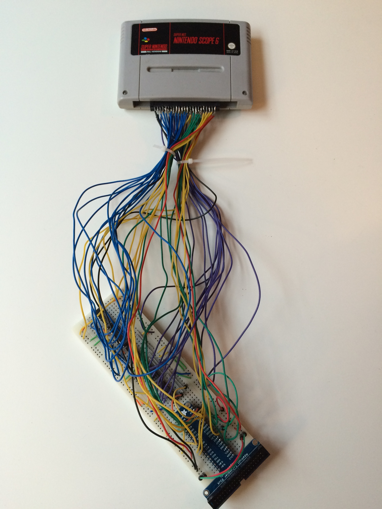
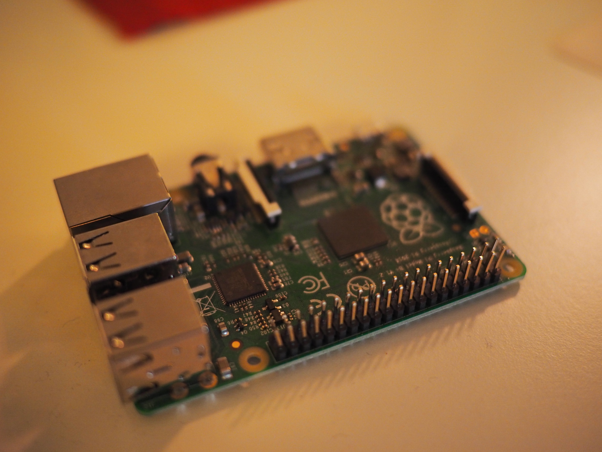
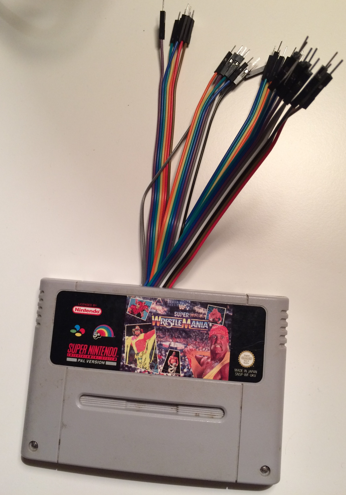
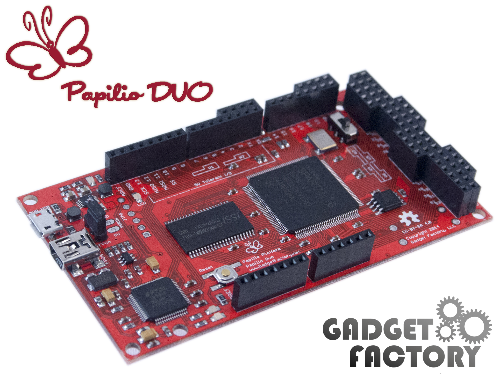

Introduction
============
I've been spending some time playing around with FPGAs. It has been quite challenging since they don't allow for as much sloppiness as a micro controller. I even managed to get a friend hooked on FPGAs. When I met him later he told me that he stopped because he got stuck in some details... And that made realize that I should write up my first stumbling steps into FPGAs. Maybe it could have helped him and maybe it will someone else! I will here assume that a FPGA is the right tool for you and describe how my understanding improved from not even beginner level to beginner level. In reality a FPGA might often not be the tool you need. But it is a fun tool!

First lets talk about why I started looking into FPGAs. At the time I had just completed a _backup_ device that could extract ROMs from a Super Nintendo Cartridge. I did a small writeup [here](/snes-cartridge-4). It looked something like this:

and it connected to the GPIO (acronym for "general purpose input/output") pins of my Raspberry PI.

Reading from a "passive" cartridge the Raspberry PI did very well. I was in full control of timing and I could even run it on 3.3V (instead of 5V like the Super Nintendo itself does) so I did not have to put in voltage conversion. The only challenge was that I needed more GPIO pins than the Raspberry PI had so I had to add some circuitry on the breadboard (that white thing that I plugged stuff into) so it could hold some state and do simple calculations.

My next idea was to connect myself directly to a cartridge plugged into a Super Nintendo. After a few iterations my setup looked something like this

On the breadboard I now had a lot of circuitry to compensate for the fact that the Super Nintendo would run the cartridge on 5.5V while the Raspberry only tolerated 3.3V on most GPIO pins. I still had too few GPIO pins but I felt like I could at least do a proof of concept. Now the Super Nintendo was in charge and I wanted to listen to requests (the cartridge acts like a memory) and give it back the correct value. I never got this to work for many different reasons. At first I felt that the reason why I couldn't listen properly on the bus (a BUS is multiple pins acting together) was because the Raspberry PI was too slow when it came to GPIO, or that linux interfered sometimes making it unstable. I did code up a reader program in pure ARM assembler to take the operation system out of the picture and while programming ARM assembler was nice it didn't do the trick. I slowly realized that maybe I had messed up something electrically in my monster connector and I got the sinking insight that I didn't knew how to debug analog electronics. I have a an oscilloscope and I did try to debug it but maybe the first thing you debug shouldn't run at 1+ Mhz and be out of your own control? Maybe! Either way it all felt very hackish and wrong. Could there be a more beautiful way?

Around this time I started reading up on FPGAs and it truly felt like the solution to all my problems. I think that this is partially because it appeal to my nature; I have full low-level control! At least compared to using a CPU that someone else did. And while they were only running at hundreds of Mhz (instead of thousands like modern CPUs) they are quite different so hopefully that could make up for it.

So I started reading! My first mental model that formed around FPGAs was that you programmed a FPGA by specifying a network (a DAG) of calculations always feeding forward. Something like this:

***********************************************************
* -------------.                                          *
*   A          |                                          *
*              v                                          *
*            .----.                                       *
* ---------->| +  +-+------------+                        *
*   B        '----' |       D    |                        *
*                   |         .--+--.                     *
*                   |         | MAX +-------------->      *
*                   v         '--+--'           F         *
*                .-----.         |                        *
* -------------->| AND +---------+                        *
*   C            '-----'    E                             *
*                                                         *
***********************************************************

Whenever inputs to the network (A,B,C) changed (from say the world outside the FPGA) the calculations specified by my program would be carried out and the answer would be available at the outputs (F) as soon as possible. The number (and kind) of operations between the input and the output would dictate the time this would take. I put the *MAX* in here to show that I didn't think of these operations as operating on just one bit; the value flowing around can be a collection of bits and the boxes any function acting on those. Since I wanted to have a large memory to read Super Nintendo ROM data from I though that somehow this DAG could read from that "all the time" by connecting the graph to the memory. Thus I wouldn't really need a state. In retrospect I didn't think very far beyond what I needed the FPGA for.

While trying to purchase a FPGA development board (not an easy task for me at least!) I read up and I was sad to understand that in a FPGA all operations were "clocked". That is inputs from outside the FPGA are only read at fixed intervals. Each such interval is called a clock cycle and on a 25 MHz FPGA each clock cycle is 40 nanoseconds long. That felt fast enough to process my inputs if they were directed to the output directly, but what about my calculations? If each logical element needed to wait until the next clock before it fed its value "forward" in the FPGA the output would come much too late. Maybe FPGAs were not the solution for my problem after all?

Here somewhere my mental model had other issues. If everything always fed "forward", how could it have a state? I clearly needed to wise up. When learning about this I had a good friend to ask silly questions to and eventually it clicked. Both of these two worlds more or less co-existed somehow. The calculations carried out in the FPGA can be either sequential (clocked) or combinational (not-clocked). And they don't always go forward.

Yes I was this naive; I did not know about clocking before I started this! To my defense I did go to math school, not electric school.

Side quest: Buying a FPGA
=========================
Purchasing a FPGA development board was not easy for me. The idea is that if you are doing a commercial product using a FPGA you will make your own PCB eventually with only the peripherals you need. You want the smallest FPGA possible since that will cut power consumption and cost of the final product. The development boards are different. They try to cater either to students or professional who don't quite know what product they are making. If you buy the wrong one it might not be possible to make it do what you need and after a while you are likely to buy another development board. In my so-far limited experience memory (DRAM, SRAM etc) is a very important factor. In particular if the memory subsystem is wrong for your application it might be hard to make everything work. I got a [Papilio DUO](http://papilio.cc/index.php?n=Papilio.PapilioDUOHardwareGuide) featuring a small variant of the Spartan-6 FPGA from Xilinx. The variant I purchases has a 2MB (mega *bytes*, not mega *bits*! Most sites for hardware specify memory sizes in bits, not bytes so be aware of that!). This made sense since I could easily fit most Super Nintendo ROMs in there.

 By now I've bought another one, partially so I can use the new [Vivado](https://www.xilinx.com/products/design-tools/vivado.html) IDE from Xilinx that is available to the 7-series FPGAs. For Spartan-6 FPGAs you need to use [Xilinx ISE](https://www.xilinx.com/products/design-tools/ise-design-suite.html) which is almost discontinued (but it seems as if they are adding Windows 10 support after all). I also kinda had to get a new FPGA because I wanted to! Hobbies are not hobbies unless you buy stuff and maybe sometime do stuff with the stuff you've bought! There are other brands of FPGAs.

 I should mention two other brands of FPGAs. First there is [Altera](https://www.altera.com/products/fpga/overview.html) that is now owned by Intel. The second one is [Lattice Semiconductor](http://www.latticesemi.com/Products.aspx#_D5A173024E414501B36997F26E842A31). They are notable because there now exist open source tool chains for some of their FPGAs. See [project IceStorm](http://www.clifford.at/icestorm/). There currently are many ongoing reverse-engineering efforts to be able to produce bit streams for various FPGAs.

 I also want to mention that there is a difference between hobbyist FPGAs and professional FPGAs. If you look at [FPGAs available in AWS](https://aws.amazon.com/ec2/instance-types/f1/) they cost thousands of US dollars. Hobbyist FPGAs on the other hand can be quite cheap.

A better mental model of our FPGA
=================================
Back to the actual FPGA. First thing first. The FPGA has a number of physical _pins_ that can be configured to be inputs, outputs or both. How the pins are configured is part of the configuration of the FPGA. On the outside of the FPGA the pins can be connected to pretty much anything that operates at the correct voltage (which is seldom above 3.3V for current FPGAs). The values at the input pins affect the computations performed by the FPGA and the outputs pins are fed results from the computations. What computations are performed is decided by the bit stream that the FPGA is programmed with. The bit stream is most often constructed through proprietary tool chains supplied by the FPGA manufacturer. The computational elements (called logical elements) of the FPGA are also configured using the bit stream. How they actually behave on an electrical level depends on exact FPGA model. It is up to the _compiler_ to know about the particulars of the FPGA being used. Today we will work on a higher level where we only need a mental model of how it all fits together so we will not discuss it in detail.

When thinking about the computation that takes places in a FPGA I like to think not about individual gates or logical elements but rather groups of such. There are two types of groups that can be connected together. The first type is called _combinational_ and the second type is _sequential_.

# Combinational computations

Yes, I made a header for this section just so I could have a header with an alliteration in it.

Combinational computations does not have an internal state. Given an arbitrary number of input signals simple computations are performed. Using simple building blocks (such as NAND, NXOR etc) more advanced computations like addition can be performed. From a high-level perspective we can assume that the computations happens at the speed of light, but in reality there is a short propagation delay associated with the computations. Different connections have different speed. Special "carry chains" are super fast. It is noteworthy that the speed of these computation is unrelated to the clock frequency that the FPGA is running at.

Let's outline how it can work. When the input signal changes the computation happens. Bit change in the network of logical elements, propagating towards the output. After a _short_ duration each output signal have a stable value. The time that it takes for different output to be stable depends on both the amount of computation taking place to compute that output bit, but also on how it was layout physically on the FPGA. Did some propagate through the faster carry chains? Was the combinational moved around on the FPGA due to being complicated, making some routes longer than others?

What value do we get if we try to access an output value before is is stable? If we only deal with values generated from within our FPGA and everything runs on the same clock, we don't need to know the answer to that question! We can even generate output from our FPGA and it doesn't really matter much (depending on what you hook into the output).

Rules to respect in our mental model:

- Arbitrary number of inputs
- Computations are performed and signals are propagating between the logical elements
- Each output become stable once all inputs it depends on have been stable for a little while
- Different output bits can become stable at different times
- If someone tries to read an output bit before it is stable the value will be undefined

But the FPGA isn't infinitely fast. It feels like someone need to care about _when_ values are stable. And someone does. The tool chain that compiles your program will determine the maximum time that the combinational networks needs until all outputs are stable. This determines the maximum length of a clock cycle. If you respect the value given to you by your compiler you will be fine for that particular device. But what is a clock cycle really?

# Clocked computations

Yes, another alliteration. I'm on fire today!

Let us start with an example. We are making a counter using only combinational logic inside the FPGA. It might sound impossible but we will use a magical device so it is OK. To make a counter we need a current state and then we want to advance it to a next state by adding one. We represent the state state as a N-bit number.

First we take the current counter value as an N-bit input to the FPGA. We need to know where we are in the sequence and since we pretend that we only have combinational logic here we need to keep the state outside of the FPGA. Based on the N-bit input we compute a N-bit output that is the next counter value. It is done using combinational logic and the output will be stable after a short duration of time.

Now it is time to use our magical external device and hook it up to the FPGA. It stores the current state and sends it to the FPGA. It also receives the next state from the FPGA outputs. It has a button that, when pressed, accepts the next state as the current state. The next state send out from the FPGA will be unstable for a short duration after a button press, but if we press the button slowly the output will be stable and we get a stable new counter state. How fast can we press the button? For a given FPGA it depends on how long chains of combinational logic we've managed to put together, as well as how they were allocated on the FPGA.

These magical devices actually exists inside the FPGA. More or less. They can only store one bit of information each and there is no button. There is, however, a global clock signal that goes off at fixed interval.

# All together

That section on clocking was short but that is because clocking on its own isn't all that fun. We need to combine combinational and sequential computations to make something interesting.

We are ready to introduce a mental model for an actual FPGA. We have two types of groups of logical elements. We will denote them M and C for now. 

M1 stores an arbitrary large state. Parts of that state is fed forward to a combinational computation box denoted C1. C1 does some simple combinational calculations to produce a new result. Parts of that result can be fed back to M1 and parts of it can be fed forward to M2.

M1 and M2 accepts their new state based on inputs whenever a clock signal arrives. Since C1 and C2 has their constant input for a full clock cycle and have a full clock cycle to finish their computation the value fed into M1 and M2 is stable.
C1 and C2 computes their outputs based on the inputs all the time, but their input is only changed whenever a clock signal arrives and M1 and M2 starts to output their new state.

Here is an illustration:

************************************************************
* ----------------------.                                  *
*   inputs              |                                  *
*                       v                                  *
*           .----.    .----.    .----.    .----.           *
*           | M1 +--->| C1 +--->| M2 +--->| C2 +---------> *
*           '----'    '-+--'    '----'    '----'           *
*              ^        |                                  *
*              |        |                                  *
*              '--------'                                  *
************************************************************

Note that this is not related to actual circuitry. This image just represents our mental model on a high level. A good way to think about this is to think that the combinational computations prepare the next state. The new state is accepted when the next clock arrives and then the combinational computations is run again for the new inputs. And loop.

# What about clock frequency?

The longer chains we have, the lower the clock frequency must be such that all outputs from combinational computations are stable when the next clock goes off. It is possible to increase the clock frequency by dividing long combinational computations into several steps, saving the intermediate values as clocked state. The FPGA itself often is specified to have a maximum clock frequency so it is not possible to run faster than that of course.

When starting with FPGAs it is easy to be bogged down in talk about meta-stable signals. It seems hard to work with and it is a real problem, but in our setup we need not worry about it just yet. Meta-stable signals are signals that are being produced by another clock. When you try to consume them there is a window where they don't have a defined value (0 or 1) and they can be anything. The signal simply isn't stable yet since the end of the external clock cycle has not been reached yet. There are ways to combat this, especially if you run at a much higher clock frequency, but I am leaving that topic for a later date!

# A note on clock frequency

When doing a simple design you can assume that the project will run on the clock frequency provided by the crystal on the FPGA development board. This could be 33Mhz, 100Mhz or something different. Unless you explicitly use the built in circuitry to generate a custom clock this is what you will get. I'm adding this note because at first I thought my design would automatically run as fast as possible. It is much more convenient to be in control since you often want to interface with external hardware so I am glad I was wrong!

Side quest: How to you develop for a FPGA?
==========================================
In the beginnings people were designing processors using gates. Maybe they didn't had FPGAs then but made [ASICs](https://en.wikipedia.org/wiki/Application-specific_integrated_circuit) instead. Then there was talk for many years about a high level language. Eventually the compilers got good enough and there was two high level language called VHDL and Verilog. I've personally only used VHDL so far and I will use the word VHDL here to mean either VHDL or Verilog. The tool chain takes the VHDL source and figures out what gates it would use for that program. It eliminates gates that are not needed and merge gates that does the same thing. I tries to do as much as possible to reduce the number of gates and increase the maximum clock frequency. It then tries to map that onto the FPGA currently being compiled for.

There are two nice things. Most IDEs have some sort of simulator where you can see what your program does without running on actual hardware. This can be nice, especially since debugging on hardware can be challenging (or impossible). The second is that you can write test programs that tests your code. This enables you to write code in functional blocks that can be tested/simulated in isolation and then put together.

There are many ready-made blocks you can use. Some come in form av standard library, some come with the IDE/tool chain and some come from somewhere else. One such place is [OpenCores](https://opencores.org/) that has a lot of cores. I especially want to mention "Soft Cores" which are processors running on the FPGA. We will discuss why you might want to have a CPU on a FPGA in the next section.

The cost of code
================
When you develop for a FPGA you might write some code that does say an increment of a counter stored in the FPGA. When the counter is stored inside the FPGA it is sort similar to how a register is stored in a processor. It is not stored in memory somewhere but it is stored inside the transistors of the chip itself. This is just one small part of the entire program running on the FPGA. The crucial thing to understand here is that it all runs in parallel. The counter increment code is always there, physically. It consumes a few flip-flops for the calculation and some more for the storage of the counter. If it has been setup so it only increments on some cycles it will just do nothing most cycles (except storing the counter). The increment flip-flops are wasted in some regard.

When you build a CPU you build it using similar tools as when you program a FPGA. But instead of trying to put the program running on the CPU inside the CPU, it is stored in memory. The CPU pulls out the next instruction and then it give it away to one a of a few functional units doing arithmetics, memory fetching, floating pointer operations etc. The instructions coming from memory are generally decomposed so that they can run on the existing functional blocks. In this way not as much flip-flops are wasted. Modern CPUs are very advanced and run multiple instructions at once pipelined to make sure all functional units are used.

These two designs are quite different. The FPGA on is superior when you are talking to external devices on a BUS on a fixed cycle. Lets say you are making a chip to do video signal conversion. When using a FPGA you have exact control over timing and can make sure that you satisfy the demand of the downstream gadgets.

Recommended Reading / Watching
==============================
* [http://www.fpga4fun.com/](http://www.fpga4fun.com/). Many small projects that helps you get a feeling for what can be done.
* [A structured VHDL design method (book chapter)](http://www.gaisler.com/doc/vhdl2proc.pdf). Once you've started writing VHDL or Verilog this article helps you organize your code.
* [A walk-through of Xilinx's Vivado FPGA design suite (Per Vognsen)](https://www.youtube.com/watch?v=uTbBw-q5JnY).
* [The Fastest, Easiest FPGA Blinker, Ever! (on IceStorm)](http://www.xess.com/static/media/pages/pygmyhdl/examples/1_blinker/fastest_easiest_FPGA_blinker_ever.html)

Lies, lies, lies...
===================
Here I put facts to illustrate where I lied or over-simplified my mental model. Note that very word is an over-simplification, these are just the bigger ones!

* FPGAs can have multiple clock domains, each with their own clock frequency. If you try to interface them you have to be careful! There is something called meta-stability that can affect you if you READ from another clock domain (something using a different clock so that you are not in sync). If you are just writing to outputs it is up to the consumer of your bits to handle meta-stability.
* There are cool ways to sync up clock domains if you have control over both sides (or if the other sides implements something you can adhere to)
* I'm still not sure how combinational results are stored in the FPGA. They must be written backwards somehow.
* FPGA pins are divided into different banks. Some FPGAs can run each bank on a different voltage. This affects what can be connected to them. The reason for this is that lower voltage leads to lower energy consumption. By only using higher voltage on the pins that needs it total energy consumption is lower compared to a chip where all pins supports the higher voltage.
* FPGAs these days have dedicated DSP blocks that can do some combination computations very fast by not using a FPGA. These typically take the form of integer multiplications with sufficient number of bits to implements floating point operations.
* Even if all computations happen inside a clock domain the output signal can be skewed. That is while all of outputs (to the outside of the FPGA) are ready at the end of a clock-cycle, they might be ready at different times. If an external device that doesn't care about the clock coming from the FPGA this can cause troubles with some external devices.

Big take-aways
==============
* Length of longest / most complicated combinational chain determines maximum possible clock frequency