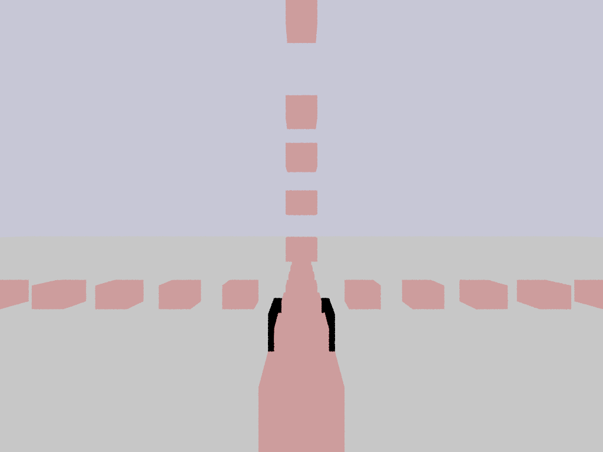
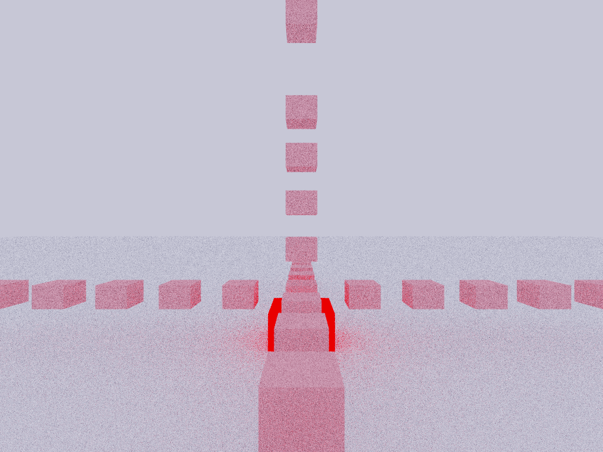

Diffuse surfaces of scene:

And here is the path traced result:

# Source code

* [post1.cpp](https://github.com/breakin/pathtracer/blob/master/post1/post1.cpp)
* [vector_math.h](https://github.com/breakin/pathtracer/blob/master/shared_code/vector_math.h)
* [shared.h](https://github.com/breakin/pathtracer/blob/master/shared_code/shared.h)
* [shared.cpp](https://github.com/breakin/pathtracer/blob/master/shared_code/shared.cpp)
* [Full project](https://github.com/breakin/pathtracer)
