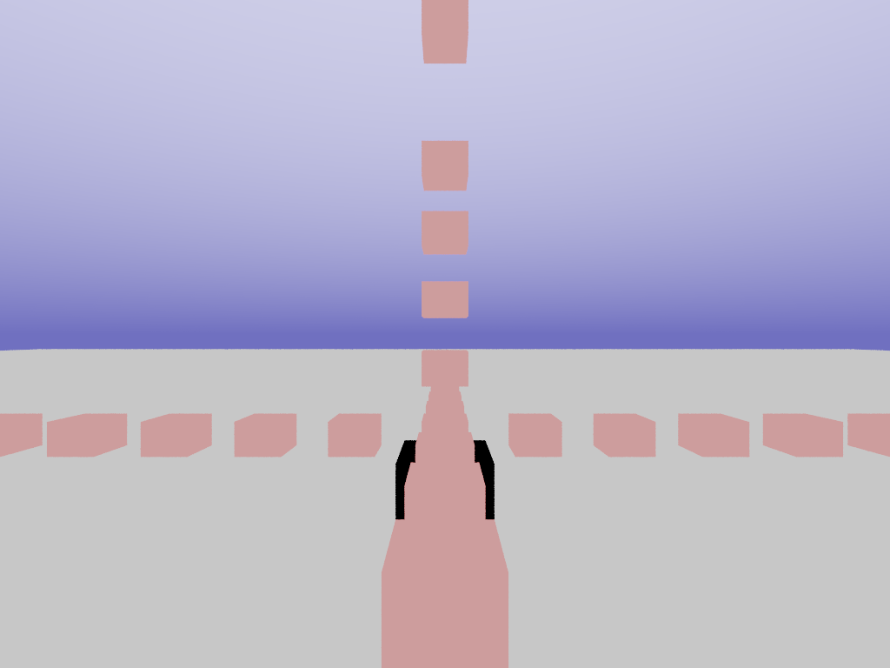
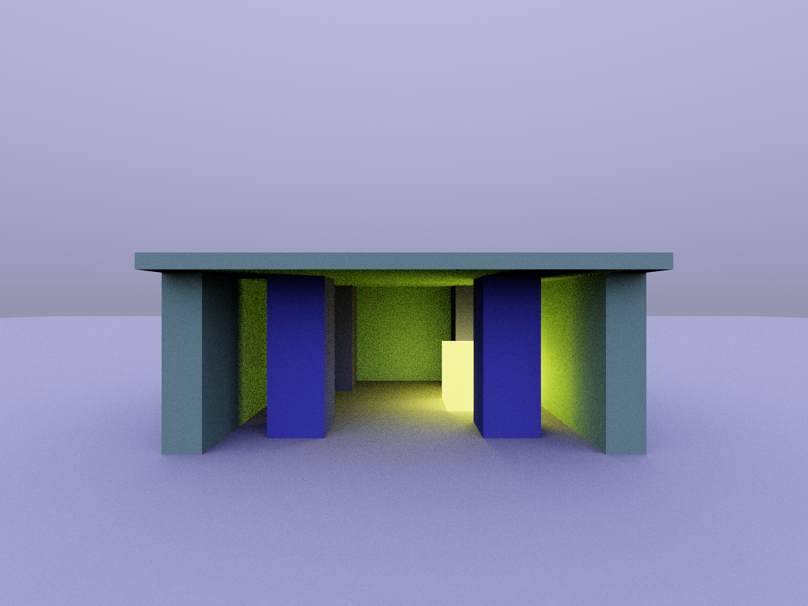

Lets start with something simple. We generate our camera rays just like in the previous post. If we miss the geometry we return the color of the sky. If we hit the scene we generate a secondary ray and see where it hits.

First we add the emissive material component of the material of the surface where we hit.
~~~~~~~~~~~~
 Float3 accumulated_color = float3(0,0,0);
 accumulated_color += intersect.emissive;
~~~~~~~~~~~~~~~~

The we calculate the direction of the secondary ray. We simply select a random direction on the hemisphere (half sphere) around the normal of the surface where our camera ray intersected the scene:
~~~~~~~~~~~~
 pos = intersect.pos + intersect.face_normal * 1E-6f; // Bias outward to avoid self-intersection
 dir = random_hemisphere(intersect.face_normal, uniform(thread_context), uniform(thread_context));
~~~~~~~~~~~~

Here we use face normal and not interpolated vertex normals. That can give a result that feel flat shaded if we were to use it on scenes with spheres or other curved objects. Lets leave the fix for that until later!

Now *random_hemisphere* calculates direction with uniform probability over the hemisphere; all directions are equally likely. The probability then to select a particular direction is 1 divided by half area of a unit sphere:
~~~~~~~~~~~~
 float area_hemisphere = float(2.0*M_PI);
 float probability_choosing_dir = 1.0f/area_hemisphere;
~~~~~~~~~~~~

And this is where we need to talk about Monte Carlo integration!

~~~~~~~~~~~~
 float brdf_without_color = dot(dir, intersect.face_normal) * float(1.0/M_PI);
~~~~~~~~~~~~

~~~~~~~~~~~~
 Float3 bounce_weight = intersect.diffuse * (brdf_without_color / probability_choosing_dir);

 // Bounce ray
 IntersectResult intersect2;
 if (!intersect_closest(scene, pos, dir, intersect)) {
  return bounce_weight * sky_color_in_direction(scene, dir);
 }

 accumulated_color += bounce_weight * intersect.emissive;
 return accumulated_color;
~~~~~~~~~~~~

# Source code

* [post2.cpp](https://github.com/breakin/pathtracer/blob/master/post2/post2.cpp)
* [vector_math.h](https://github.com/breakin/pathtracer/blob/master/shared_code/vector_math.h)
* [shared.h](https://github.com/breakin/pathtracer/blob/master/shared_code/shared.h) / [shared.cpp](https://github.com/breakin/pathtracer/blob/master/shared_code/shared.cpp)
* [tour index](/pathtracing-tour-0)
